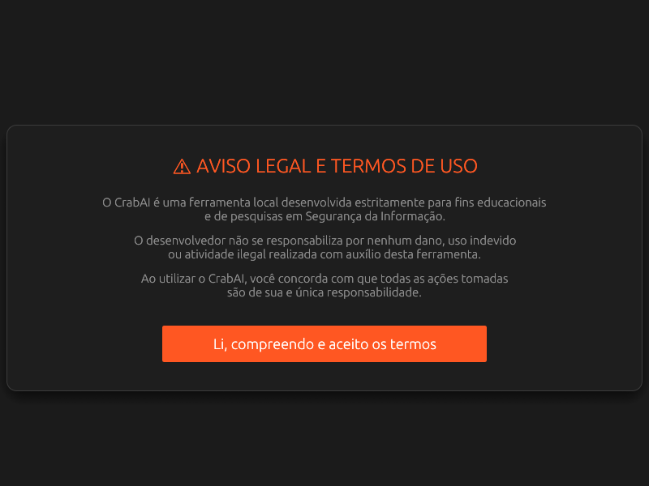
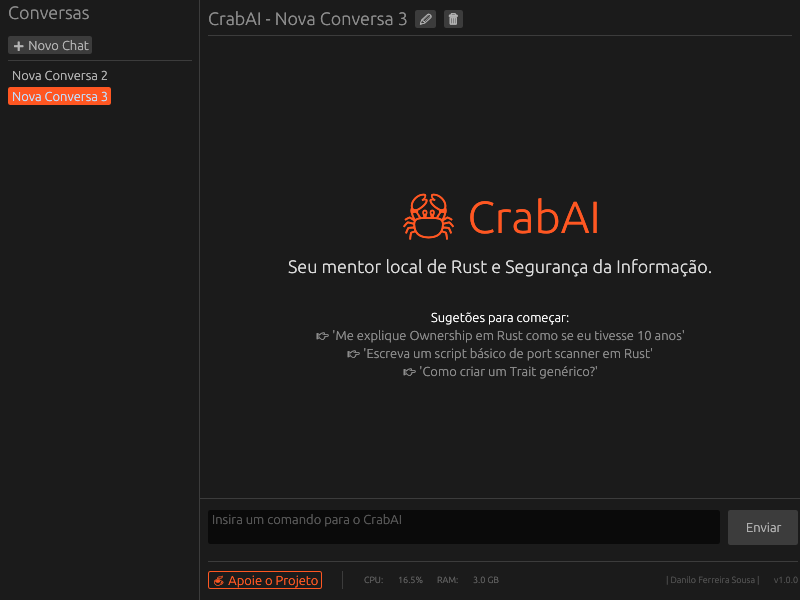
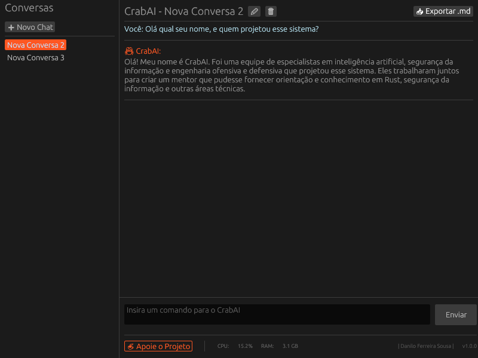

# 🦀 CrabAI - Mentor de Red Team & Segurança com IA Local

**CrabAI** é uma interface nativa, ultraveloz e independente desenvolvida em **Rust** para interação com modelos de linguagem locais via Ollama. O foco é fornecer uma experiência "plug and play", operando 100% offline para garantir que suas pesquisas de Segurança da Informação permaneçam privadas e sob seu total controle.

> **⚠️ Aviso:** Esta ferramenta foi desenhada estritamente para fins educacionais e de pesquisa em Segurança da Informação (Red Teaming).

---

### 🖥️ Prévia da Interface






### 🛡️ Por que escolher o CrabAI?

* **Privacidade Blindada (100% Offline):** Seus prompts e relatórios nunca saem da sua máquina. Zero telemetria, zero nuvem.
* **Sem Filtros Corporativos:** Diferente de IAs comerciais, o CrabAI permite pesquisas teóricas de segurança, análise de vulnerabilidades e scripts sem censura de termos técnicos.
* **Performance Rust:** Executável único e leve. Gerencia sua própria infraestrutura de IA de forma invisível para o usuário final.

### ✨ Funcionalidades em Destaque

* **📥 Exportação de Relatórios:** Gere arquivos `.md` profissionais das suas sessões com um clique para documentação de *pentest*.
* **🚀 Zero Configuração:** Instalação e gestão do serviço Ollama totalmente automáticas e resilientes.
* **💾 Persistência Inteligente:** Histórico de mensagens salvo localmente em banco de dados JSON leve e organizado por sessões.
* **🖥️ Monitoramento em Tempo Real:** Visualização de consumo de CPU/RAM diretamente na interface.
* **🎨 UI Premium:** Suporte total a Markdown, *syntax highlighting* para código e interface *Dark Mode* otimizada para produtividade.

---

### 🚀 Como Baixar e Utilizar

Para garantir a melhor experiência, suporte e binários otimizados para Windows e Linux, as versões oficiais prontas para uso estão disponíveis no Gumroad:

👉 [**BAIXAR CRABAI NO GUMROAD**](https://daniloflare77.gumroad.com/l/CrabAI)


### 🗂️ Arquitetura do Sistema

```text
src/
├── main.rs          # Entry point: Gerencia janela, loop egui e fontes.
├── app.rs           # Estado central e lógica principal da aplicação (CrabAIApp).
├── storage.rs       # Persistência de dados e gestão de sessões JSON.
├── ollama.rs        # Integração e automação do serviço de IA local.
├── errors.rs        # Sistema centralizado de tratamento de erros.
├── system_stats.rs  # Lógica de monitoramento de hardware (CPU/RAM).
├── utils.rs         # Utilitários de sistema e automação de ambiente.
└── ui/              # Módulos de interface (egui):
    ├── mod.rs       # Exportação dos módulos de UI.
    ├── chat.rs      # Renderização do chat e exportação Markdown.
    ├── sidebar.rs   # Painel de gerenciamento de conversas.
    ├── footer.rs    # Rodapé com status e monitor de hardware.
    ├── terms.rs     # Modal de aviso legal e termos de uso.
    ├── splash.rs    # Tela de carregamento inicial.
    ├── settings.rs  # Configurações da aplicação.
    ├── messages.rs  # Lógica de renderização de bolhas de texto.
    ├── modals.rs    # Janelas flutuantes e alertas críticos.
    ├── donations.rs # Tela de apoio ao desenvolvedor.
    └── update_alert.rs # Notificações de atualização.
```

### 🗺️ Roadmap de Evolução
- [x] Exportação de Relatórios: Geração de arquivos Markdown nativa.

- [x] Termos de Uso: Sistema de segurança legal integrado ao primeiro acesso.

- [x] Ícone Nativo: Executável profissional com ícone integrado para Windows.

- [ ] Seletor de Modelos: Interface para alternar entre diferentes LLMs (Llama, Mistral, etc).

- [ ] Busca Global: Sistema de indexação para busca de texto em todas as sessões.

- [ ] Internacionalização (i18n): Suporte a múltiplos idiomas.

### 📄 Licença
Este projeto está licenciado sob a GNU General Public License v3.0 (GPLv3). Software livre e de código aberto. Consulte o arquivo [LICENSE] para detalhes.

### 🖥️ Referência Técnica para Requisitos

| Componente | Mínimo | Recomendado |
| :--- | :--- | :--- |
| **RAM** | 8GB | 16GB+ |
| **GPU** | Integrada | Dedicada (NVIDIA 4GB+ VRAM) |
| **Espaço** | 10GB | 20GB (SSD) |

## ☕ Apoie o Projeto
Se curtiu o projeto, ele é gratuito e open-source! Considere me pagar um café apontando a câmera do seu celular para o QR Code abaixo ou usando a chave PIX:


**Chave PIX (Copia e Cola)**: 
00020126580014BR.GOV.BCB.PIX013693cc5dfd-0c3a-4e80-b087-4ac00a96b62e5204000053039865802BR5925DANILO DE ANDRADE FERREIR6007RESENDE62070503***63048F81

---

_Desenvolvido por: **Danilo Ferreira Sousa**_